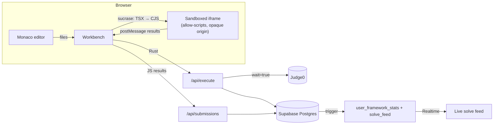
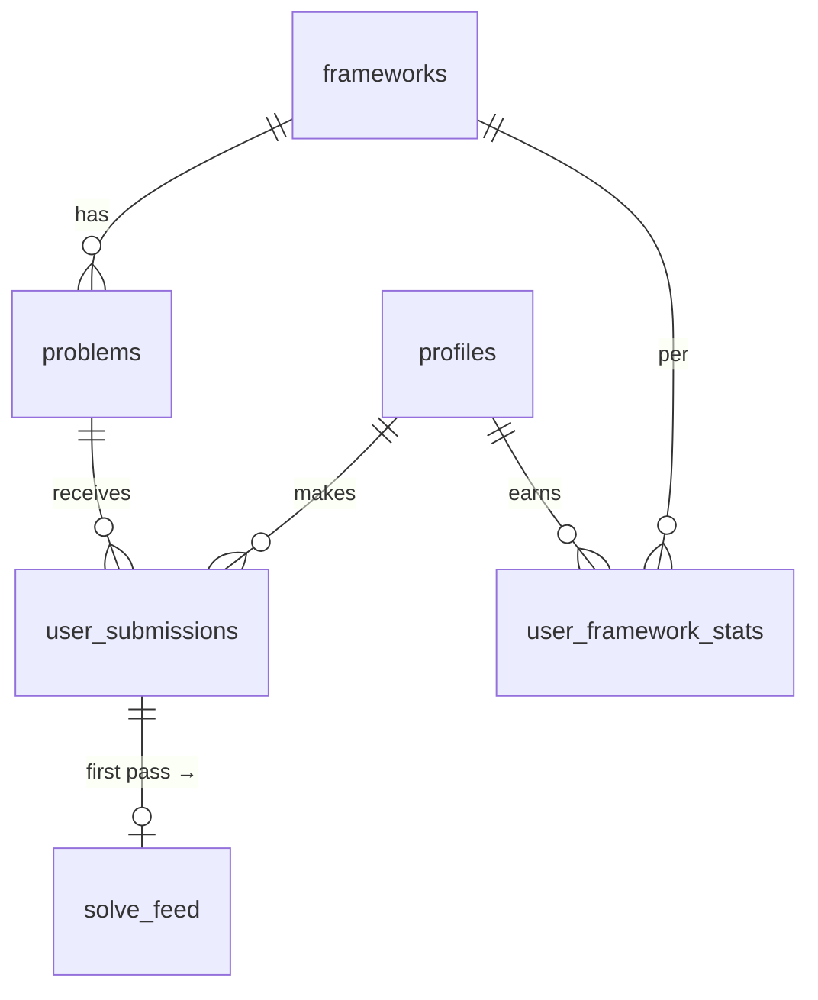

<p align="center"></p>

# CodeSim

Interactive framework-mastery platform. Solve hands-on React, Next.js, TypeScript
and Rust challenges in a real editor with instant test feedback, earn XP, and
climb a live leaderboard.

**Stack:** Next.js 15 (App Router) · TypeScript · Tailwind CSS v4 · shadcn/ui ·
Supabase (Postgres, Auth, Realtime) · Monaco · react-resizable-panels · Recharts · Vercel

## Getting started

```bash
cp .env.example .env.local     # Supabase URL + anon key, optional Judge0 runner
npm install
npx supabase db push           # applies supabase/migrations/*
psql "$DATABASE_URL" -f supabase/seed.sql   # frameworks + starter problems
npm run dev                    # also builds public/sandbox/runtime.js
```

Deploying to Vercel + Supabase: see [DEPLOY.md](DEPLOY.md).

In Supabase, enable email magic links and add `<site>/auth/callback` to the
redirect allow-list.

## Architecture



### Code execution

| Framework runtime | Where it runs | How |
| --- | --- | --- |
| `browser` (React, Next.js, TypeScript) | Client | Files are transformed with **sucrase** (TS + JSX + ESM → CommonJS) and posted into an `<iframe sandbox="allow-scripts">`. The iframe loads `/sandbox/runtime.js`, a self-hosted bundle of React 19 plus a small test harness, so nothing depends on a third-party CDN. |
| `judge0` (Rust) | Server | `/api/execute` loads the test cases **from the database**, runs each case on Judge0 (`language_id` 73), and records the verified result. |

The sandbox has no `allow-same-origin`, so user code gets an opaque origin: it
cannot read the app's cookies, storage or DOM. The parent only accepts messages
whose `source` is its own iframe. A run that doesn't answer within 8 s is treated
as an infinite loop, and the iframe is replaced.

`scripts/build-sandbox-runtime.mjs` builds the runtime (`predev` / `prebuild`).
It's a classic script, not a module, because module scripts would need CORS
headers to load into an opaque-origin frame.

> **Upgrade path:** for full Node toolchains (Vitest, real Next.js dev server) swap
> the iframe runner for [WebContainers](https://webcontainers.io). That needs
> `Cross-Origin-Embedder-Policy: require-corp` + `Cross-Origin-Opener-Policy: same-origin`
> headers and a StackBlitz commercial licence for production use.

### Test suite format (`problems.test_suite`)

Browser problems:

```json
{
  "entry": "App.jsx",
  "tests": [
    { "name": "starts at zero",
      "code": "const App = require('./App').default;\nconst root = await render(<App />);\nexpect(root.textContent).toContain('Count: 0');" }
  ]
}
```

Each `code` is the body of an async function with `require`, `React`, `render`,
`act`, `click`, `type` and `expect` (`toBe`, `toEqual`, `toContain`, `toBeTruthy`,
`toBeFalsy`, `toBeGreaterThan`) in scope. Modules are re-evaluated for every test.
After the tests, `entry`'s default export stays mounted as the live **Preview**.

Judge0 problems:

```json
{ "cases": [{ "name": "example", "stdin": "1 2 3 4", "expected_output": "6" }] }
```

### Trust model

- `solution_code` is hidden from clients with **column privileges** (RLS is
  row-level only). Always select `PROBLEM_COLUMNS`, never `*`.
- `user_framework_stats` and `solve_feed` are written only by the
  `on_submission_inserted` trigger. XP is awarded once per problem
  (beginner 10 · intermediate 25 · advanced 50).
- Rust results are produced server-side and trusted. Browser results are
  reported by the client, so a determined user could fake a pass. That's fine for
  practice XP; move grading server-side before attaching real rewards.

## Features

- **Workbench:** Monaco (left) · problem statement / live preview (top right) ·
  test results and console (bottom right), all resizable. Drafts autosave to
  `localStorage`.
- **Live leaderboard:** first-time solves stream in over Supabase Realtime, plus top XP.
- **Dashboard:** accuracy radar per framework, a 16-week activity heatmap, and
  totals for XP, problems solved and time spent.

## Data model



## Design system

| Token | Hex |
| --- | --- |
| Canvas | `#09090B` Pitch Black |
| Primary | `#00FF66` Neon Green |
| Secondary | `#D946EF` Vibrant Pink/Purple |
| Text | `#FFFFFF` |
| Surface | `#18181B` Zinc 900 |

Logo: a neon-green `>_` terminal prompt overlapping a purple bracket on black
([public/logo.svg](public/logo.svg)).
